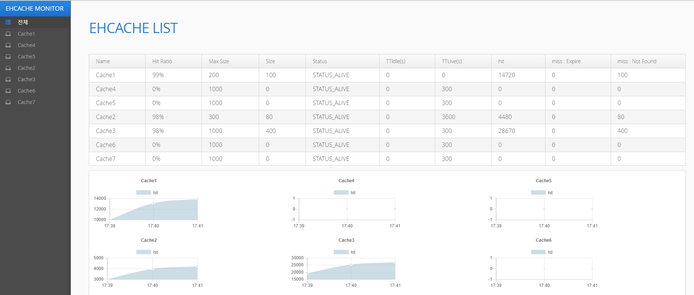
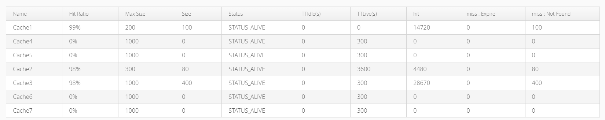
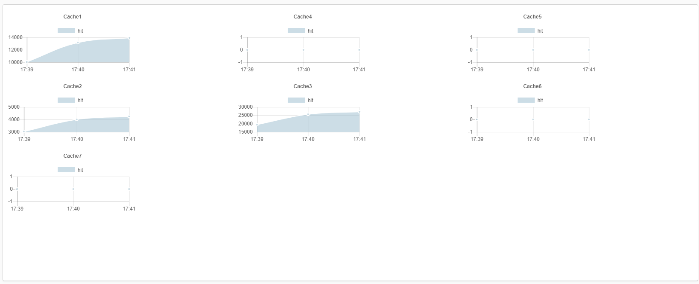
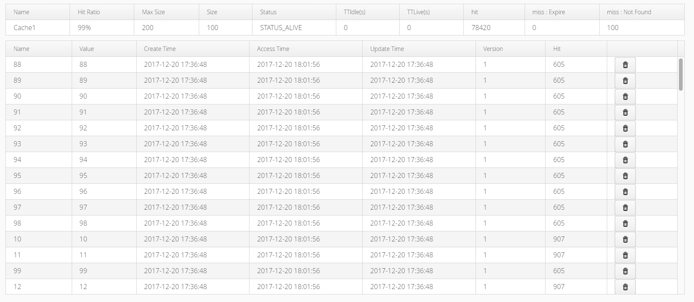
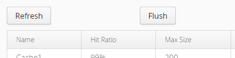
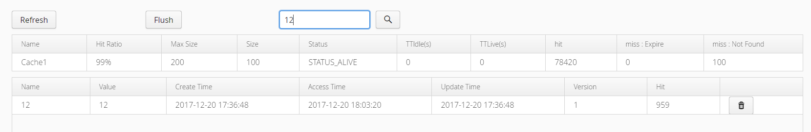

# spring-boot-ehcache-monitor

[  ](https://bintray.com/kingbbode/springboot/spring-boot-ehcache-monitor/_latestVersion)

## SPEC

- Spring Framework 4
- Ehache 3
- Vaadin 8
- Vaadin Chartjs

## ENVIRONMENT

- JDK 1.8
- Spring Boot 

## Setup

### build.gradle

```
repositories {
    jcenter()
}

dependencies {
    compile 'com.github.kingbbode:spring-boot-ehcache-monitor:{version}'
}


dependencyManagement {
    imports {
        mavenBom "com.vaadin:vaadin-bom:8.1.0"
    }
}
```

## Usage

### Example



---

### Path

`your.application.com/admin/ehcache`

---

### DashBoard

#### EhCache LIST



- 전체 Cache 리스트와 기본 정보를 노출

#### Hit Line Chart



- 분 단위 Cache Hit Line Chart

---

### Cache Detail

#### Table



- Cache 기본 정보와 상세 Cache 데이터 리스트
- 삭제 : 특정 Cache 의 특정 데이터를 삭제 가능

#### Refresh & Flush



- Refresh : 새로고침 없이 데이터를 갱신
- Flush : 캐시 전체 데이터를 삭제

#### Search 



- Cache 데이터의 Key 값 검색 지원

## Description

- Ehcache 의 쉬운 모니터링 툴이 없어서 만듦.
- 전체적인 기능은 RMI 환경을 지원
    - 상세 조회, 삭제에 대한 기본적인 기능은 RMI 환경을 지원.
    - 통계 데이터는 단일 서버에 대한 데이터만 노출.
    - 분산 환경이라면, 대부분 통계 데이터가 거의 동일한 추이를 보이므로, 단일 서버에 대한 통계 모니터링만으로 충분할 수도 있다고 판단.
    - RMI 가 통계 데이터를 지원하지 않으며, 몇 가지 통계를 가져올 순 있지만 서비스에 영향을 줄 수 있으므로 스펙 제외.
- Spring Security 를 사용하여 'admin/cache' 에 대한 접근을 제한할 것을 추천.
